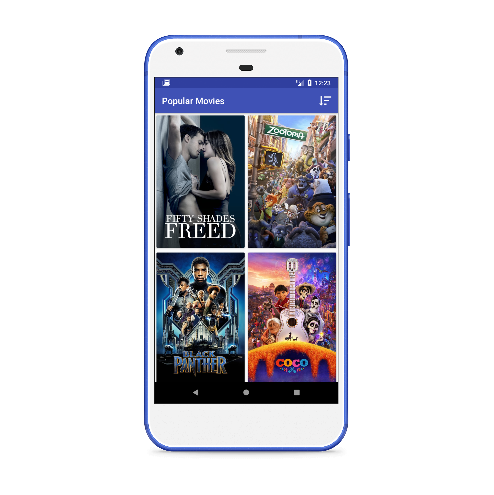
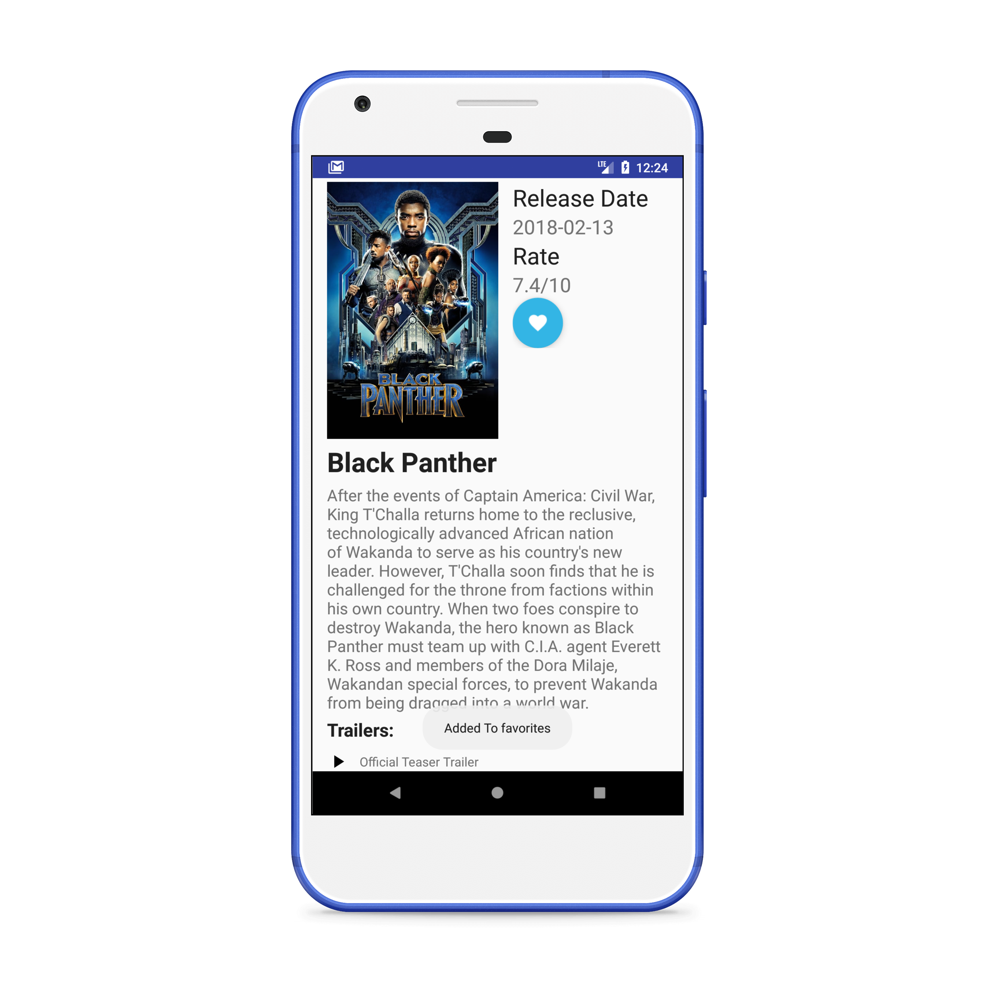
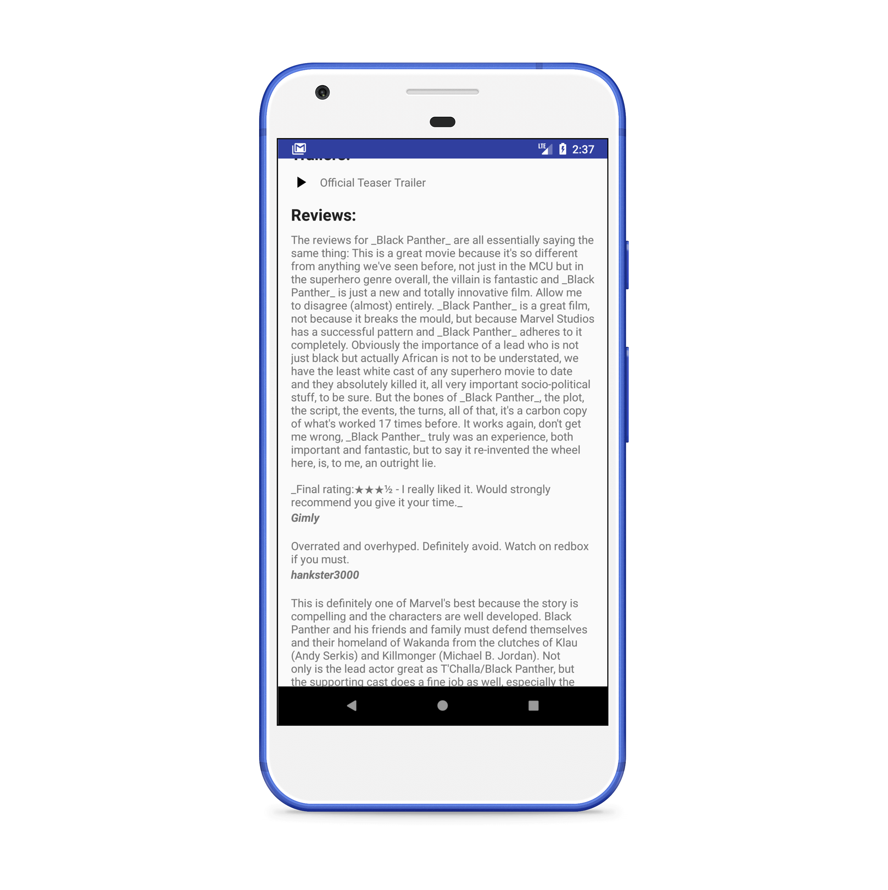

# Popular Movies
Android developer nanodegree: Project 1 (Stage 1&amp;2)

A fully functional and colorful android app which I made from scratch for Android Developer Nanodegree program in Udacity. This app reveals the power of adaptive UI both for phone and tablet devices.

# Features
- Discover the most popular or the highest rated movies
- Displayes details about movies (ratings, release date, reviews)
- Shows videos related to movies (trailers)

# How to use 
The app uses [IMDB Movie API] (https://www.themoviedb.org/documentation/api) to retrieve movies up-to-date, So you need to put your own API key in `app/gradle.properties` to build this app 

# Screenshots

# Installation 
You can safely try a clean beta version from here 
https://drive.google.com/open?id=1tzNLrLCrbBgDzRN9b2PrWoo0opwupAyD

# Libraries
- [Picasso](http://square.github.io/picasso/)
- [Butterknife](http://jakewharton.github.io/butterknife/)

# Testing 
 *The app is tested on Nexax 5x API 27 and soon on Nexax 10 tablet API 24
 
*Popular Movies was highly evaluated by certified Udacity code reviewer and was graded as "Exceeds Specifications".*
 
 
# Android Developer Nanodegree

